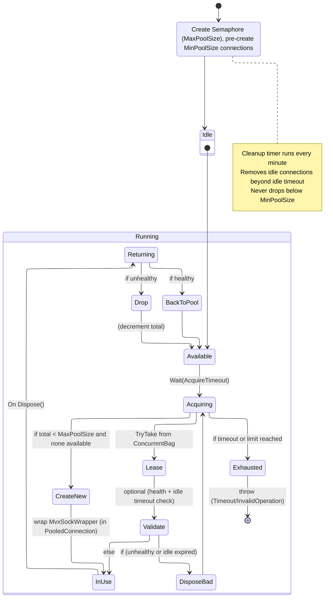

# Connection Pool Lifecycle

Updated: 2026-01-12

```mermaid
---
config:
  theme: light
  layout: elk
  look: classic
---
stateDiagram-v2
  [*] --> Initialized
  Initialized: Create Semaphore (MaxPoolSize), pre-create MinPoolSize connections

  Initialized --> Idle

  state Idle {
    [*] --> Available
    Available --> Acquiring: Wait(AcquireTimeout)
  }

  state Running {
    Acquiring --> Lease: TryTake from ConcurrentBag
    Acquiring --> CreateNew: if total < MaxPoolSize and none available
    Acquiring --> Exhausted: if timeout or limit reached

    Lease --> Validate: optional (health + idle timeout check)
    Validate --> DisposeBad: if (unhealthy or idle expired)
    DisposeBad --> Acquiring
    Validate --> InUse: else

    CreateNew --> InUse: wrap MvxSockWrapper (in PooledConnection)
    Exhausted --> [*]: throw (Timeout/InvalidOperation)

    InUse --> Returning: On Dispose()
    Returning --> BackToPool: if healthy
    Returning --> Drop: if unhealthy

    BackToPool --> Available
    Drop --> Available: (decrement total)
  }

  note right of Initialized
    Cleanup timer runs every minute
    Removes idle connections beyond idle timeout
    Never drops below MinPoolSize
  end note
```

Notes:
- Validation on acquire removes unhealthy/idle connections.
- Cleanup timer ensures pool hygiene without dropping below the minimum size.
