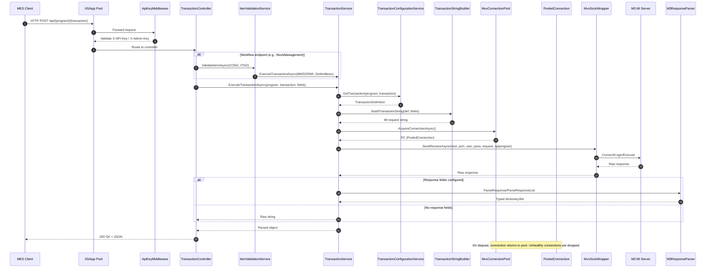

# Transaction Execution Sequence

Updated: 2026-01-12

```mermaid
sequenceDiagram
  autonumber
  participant Client as MES Client
  participant IIS as IIS/App Pool
  participant MW as ApiKeyMiddleware
  participant C as TransactionController
  participant VS as ItemValidationService
  participant S as TransactionService
  participant CFG as TransactionConfigurationService
  participant SB as TransactionStringBuilder
  participant CP as MvxConnectionPool
  participant PC as PooledConnection
  participant SW as MvxSockWrapper
  participant M3 as M3 MI Server
  participant RP as M3ResponseParser

  Client->>IIS: HTTP POST /api/{program}/{transaction}
  IIS->>MW: Forward request
  MW-->>IIS: Validate X-API-Key / X-Admin-Key
  IIS->>C: Route to controller

  alt Workflow endpoint (e.g., StockManagement)
    C->>VS: ValidateItemAsync(CONO, ITNO)
    VS->>S: ExecuteTransactionAsync(MMS200MI, GetItmBasic)
  end

  C->>S: ExecuteTransactionAsync(program, transaction, fields)
  S->>CFG: GetTransaction(program, transaction)
  CFG-->>S: TransactionDefinition
  S->>SB: BuildTransactionString(def, fields)
  SB-->>S: MI request string

  S->>CP: AcquireConnectionAsync()
  CP-->>S: PC (PooledConnection)
  S->>SW: SendReceiveAsync(host, port, user, pass, request, apiprogram)
  SW->>M3: Connect/Login/Execute
  M3-->>SW: Raw response
  SW-->>S: Raw response

  alt Response fields configured
    S->>RP: ParseResponse/ParseResponseList
    RP-->>S: Typed dictionary/list
  else No response fields
    S-->>C: Raw string
  end

  S-->>C: Parsed object
  C-->>Client: 200 OK + JSON

  note over CP,PC: On dispose, connection returns to pool. Unhealthy connections are dropped.
```
